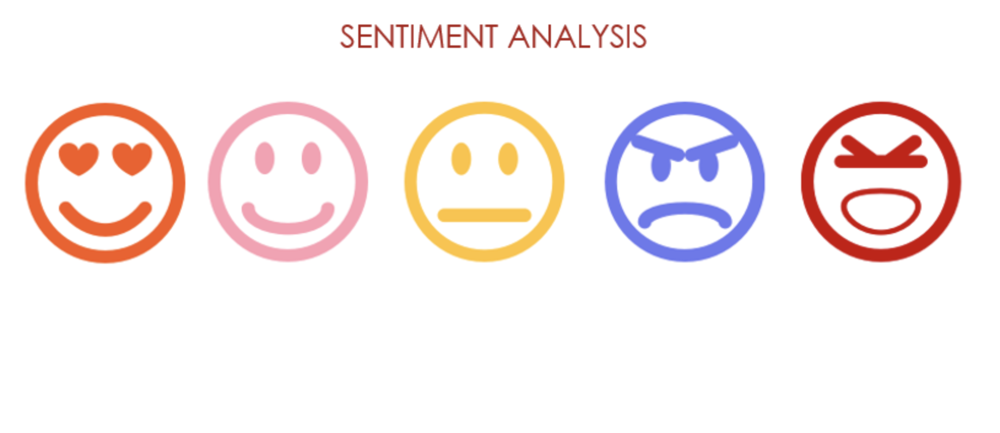
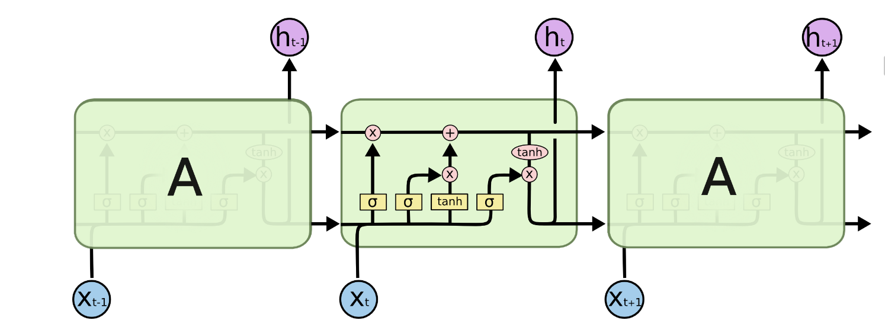
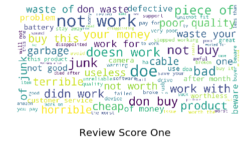
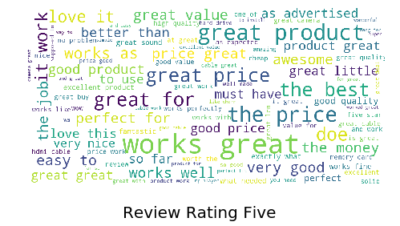
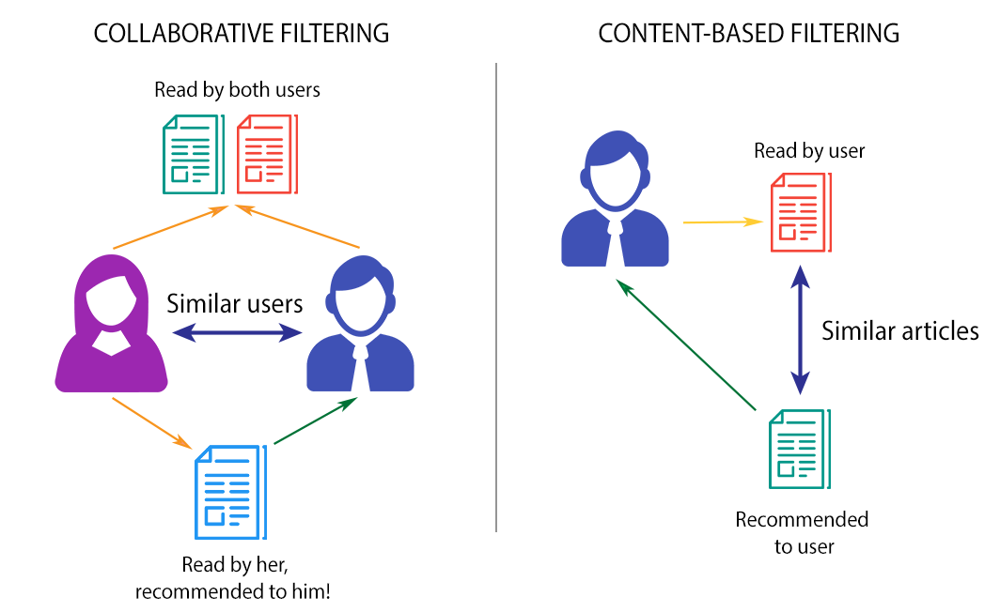
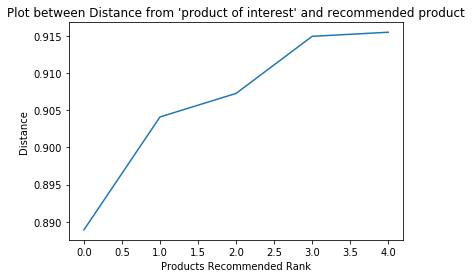

# LSTM Based Sentiment Prediction And Recommenders

This project illustrates Neural Network approach to sentiment prediction and is a continuation of my previous project [Sentiment Prediction](https://github.com/Niv-19/Sentiments_Prediction_Amazon "Previous project") to further enhance sentiment prediction of Amazon products reviews using most recent technique: Long Short-Term Memory (LSTM) Neural Network.  

Also, two types of product recommender systems are created:
*   Content Based 
*   Collabortive Filtering using unsupervised and supervised KNN.

---
## Data
The data consisted on 1.6M reviews for Electronics with its associated ratings between 1 to 5. The data was taken from here: [Amazon Customer reviews](http://jmcauley.ucsd.edu/data/amazon "Dataset for project").
 
Only the Electronics sub-category and its metadata have been used for this project. 

As part of chosing the best LSTM model, a subset of first 500K reviews were taken out of 1.6M reviews for training and validating the model. When the best model was selected, the model was retrained on 1M data and last 600K rows were left as hidden unseen data. 

The Ratings between 1 and 5 were used to create Sentiment Feature which converts ratings 3,4 & 5 as Positive, 1 & 2 as negative reviews. 

### Data Preparation
The data contained 9 columns out of which, product ID, reviewer ID, rating and review-summary were used to perform feature engineering and create required fields.

Before fitting the model, following processing were done:  
* Lowercasing all words in reviews.
* Removing Special Characters ( . , ! ? ‘ etc)
* Convert words into vectors using Tokenizer with 2500 most common words.
* Convert text to sequence that indicate the ordered frequency of each word in the dataset.
* Include max length and padding to the text sequences.
* Sentiments converted into 1 and 0.
* Split the data into training and validation data.

Review summaries were cleaned as mentioned above and used as the feature and sentiments (positive/negative) as target for LSTM model.

---
## What is LSTM?
LSTMs, a very special kind of Recurrent Neural Network which works, for many tasks, much better than the standard version RNN.

An LSTM has three of these gates, to protect and control the cell state.
Forget Gate
Input Gate
Output Gate

In RNN, as the gap between depenedent words increase, model becomes unable to learn to connect the information.

LSTMs are explicitly designed to avoid the long-term dependency problem. The key to LSTMs is the cell state c(t). A cell state is an additional way to store memory, beyond using the hidden state h(t).  

LSTM Architecture: 

### Word Embedding
Word Embeddings are a distributed representation for text that is perhaps one of the key breakthroughs for the impressive performance of deep learning methods on challenging NLP problems. 
Word vocabulary created by Tokenizer is used by Word Embedding layer and each word is mapped to one specific vector. **These vector values are automatically learned by the neural network which leads to independency on domain knowledge.**
These vectors are then fed to next layers of LSTM network. 

### Fitting and Evaluating Model
Naturally, LSTMs are bound to overfitting due to its complex architecture. 
Different LSTM models were created using different combinations of hyper-parameters as mentioned below: 
* Number of layers (LSTMs, Dense).
* Number of units (nodes) in a layer.
* Strength of Dropouts
* Type of Activation Function (relu, tanh, sigmoid)
* Batch size ( for Gradient Descend)
* Learning rate 
* Number of Epochs

Model that was obtained was with 1 embedding layer of 100 output dimensions, 2 LSTM layers, 1 bidirectional LSTM layer and 1 Dense output layer with 10 epochs. 
Below are the graphs for Accuracy and Loss for the above model. 

  

As per the plots above, epoch of 2 gives best result as the model starts to overfit later. Therefore, epoch of 2 is selected.

### Result
>The model was trained with only 2 epochs. The training accuracy obtained was **92.15%** and validation accuracy was **93%**. 
The model was tested with unseen data of 1.1M reviews and the obtained accuracy was **88.7%** which is way more than accuracy obtaned by Random Forest (74.8%).

### Popular words in negative comments:

### Popular words in positive comments:

--- 

# Recommenders

---
## Contest Based Recommender System 
One popular technique of recommendation/recommender systems is content-based filtering. Content here refers to the content or attributes of the products you like. In this recommender product features have been used as the attribute. So, the idea in content-based filtering is to tag products using certain keywords, understand what the user likes, look up those keywords in the database and recommend different products with the same attributes.

Feature of products were converted into vectors using TfidfVectorizer. A similarity matrix of products was created using sigmoid function.

### Pros of Conten based Recommender:
>1.  User independence: The content-based method only has to analyze the items and a single user’s profile for the recommendation.
>2. No cold start: As opposed to collaborative filtering, new items can be suggested before being rated by a substantial number of users.
>3. Increase the probability of user buying the product as she/he gets several options.

### Cons of Conten based Recommender:
>1.  Limited content analysis: If the content doesn’t contain enough information to discriminate the items precisely, the recommendation itself risks being imprecise.
>2.  Over-specialization: Content-based filtering provides a limited degree of novelty. Therefore, recommendations can be monotonous. 

---
## Collaborative Filtering using Unsupervised KNN
In collaborative filtering model, ratings were used to create the relation between user and recommended products. A sparse matrix was formed using ratings which denote each product in n-vector format. These vectors denote the position of the product in  n-dimensions. 
Cosine similarity was used as metric in unsupervised K-Nearest Neighbors model to find first 5 other nearest products for recommendations. 

In order to test the performance of the model, a graph was plotted to see a positive linear relationship between recommended products and distance as shown below. 

## Item-based Collaborative Filtering using Supervised KNN
In order to evaluate the performace of the recommender, supervised KNN approach was utilized. Average rating and complete summary (combined review summary of all reviewer) for each product which had more than 10 reviews was obtained. 
After text cleaning, complete summary was converted into vectors using CountVectorizer and used as the feature and avergae rating as the target for supervised KNN model. 
The data was then split into training and testing data. Different models were created using values of K as 3, 5 or 7 and different algorithms as Brute, ball tree and kd tree were tested. 

#### Result
Minimum RMSE was obtained by K=7 and algorithm =Brute of **0.69** and accuracy of **64.2**. This tells us about the **disadvantage of sparsity of user/rating matrix** (collaborative filtering dependency on user interactions). Recommender system becomes better with more ratings, user interactions with products.

### Pros of Item-item collaborative filtering
>1. Very relevant recommendations: Based on ratings given by users.
>2. Novelty: The model can help users discover new interests.
>3. No feature slection needed, works for any kind of item.
>4. Bigger the database, more the past behaviors, better the recommender.

### Cons of Item-item collaborative filtering
>1. Cold start: Need enough users in the system to find a match
>2. First rater: Can't recommend an item that has not been previously rated.
>3. Popularity bias: tends to recommend popular items
>4. Dependency on users interaction: sparse user-rating matrix.

